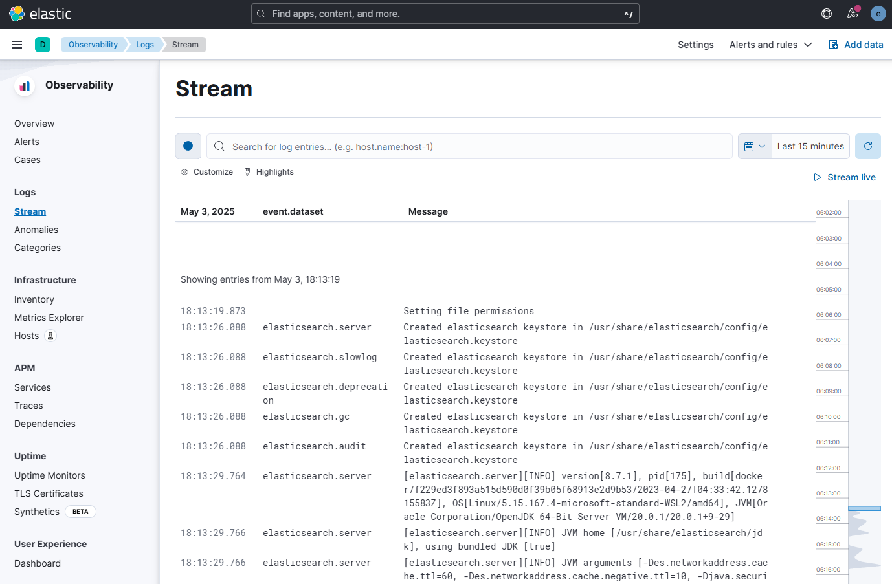

# FileBeat

You may need to remove write permission on `filebeat.yml`

Once FileBeat and ElasticSearch are running, go to [Log Stream](http://localhost:5601/app/logs/stream).
Create the out-of-the-box default ruleset.

## Download Log Data
`wget http://media.sundog-soft.com/es/access_log`